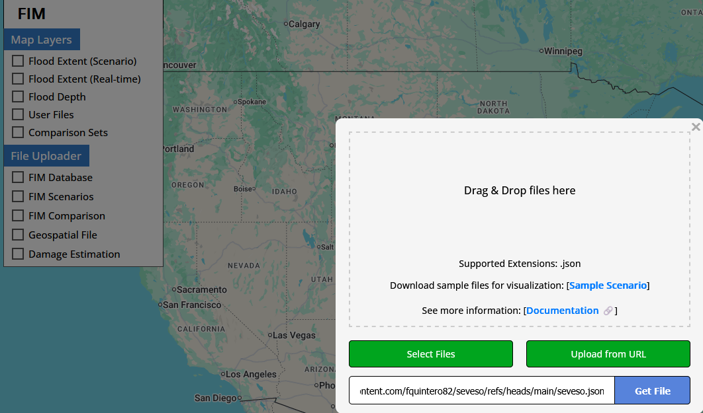
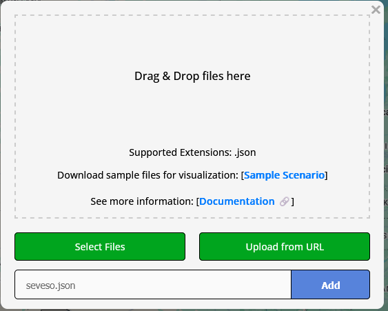
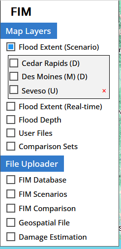
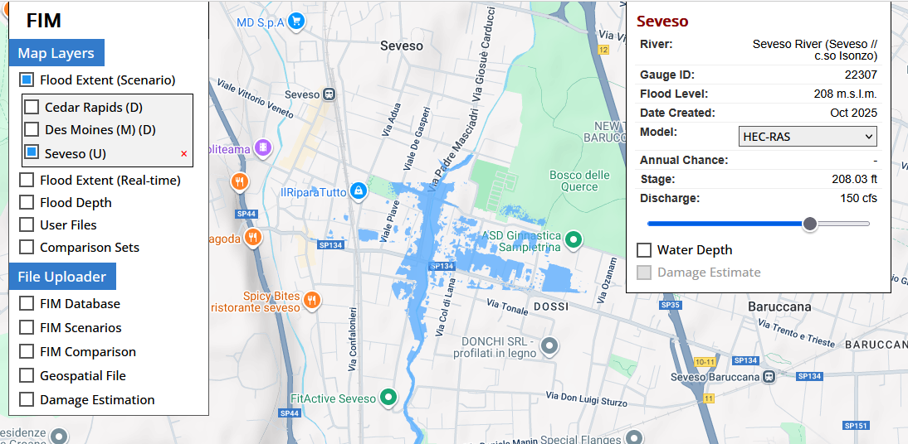

# **Flood inundation mapping for Seveso River, Italy**

Here is presented an application for Seveso, Italy, using the FIM deck, developed by the Hydroinformatics Lab at the University of Iowa.

# Instructions

Visit https://hydroinformatics.uiowa.edu/lab/fims/

On the left panel, click on FIM Scenarios, click on Upload from URL
and paste the next link
https://raw.githubusercontent.com/fquintero82/seveso/refs/heads/main/seveso.json

Click on Add

Click on Flood Scenarios and select Seveso

Browse scenarios using the slider

# Disclaimer: Demonstration Only
The information, data, and flood inundation maps presented on this website are for demonstration and visualization purposes only.

These maps are based on modeling and simulated data, and may not accurately reflect actual flood events, water levels, or inundation areas. They should not be used as the sole basis for any real-world planning, emergency response, property assessment, or financial decisions.

The developer and/or host of this website make no warranty as to the accuracy, completeness, or reliability of the information provided. By using this website, you acknowledge and agree that the developer is not responsible for any liability, loss, or damage resulting from decisions made based on the presented information.

Always consult with official government sources, emergency services, and licensed professionals for authoritative flood risk information and guidance.
