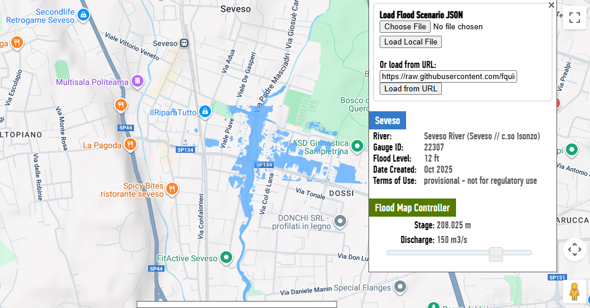

# **Flood inundation mapping for Seveso River, Italy**

Here is presented flood inundation mapping application for Seveso, Italy.

# Instructions

Visit https://s-iihr80.iihr.uiowa.edu/flood

On the load from URL option, paste this link:
https://raw.githubusercontent.com/fquintero82/seveso/refs/heads/main/seveso.json

Browse scenarios using the slider

# Disclaimer: Demonstration Only
The information, data, and flood inundation maps presented on this website are for demonstration and visualization purposes only.

These maps are based on modeling and simulated data, and may not accurately reflect actual flood events, water levels, or inundation areas. They should not be used as the sole basis for any real-world planning, emergency response, property assessment, or financial decisions.

The developer and/or host of this website make no warranty as to the accuracy, completeness, or reliability of the information provided. By using this website, you acknowledge and agree that the developer is not responsible for any liability, loss, or damage resulting from decisions made based on the presented information.

Always consult with official government sources, emergency services, and licensed professionals for authoritative flood risk information and guidance.
